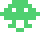

# Defeat Space Invaders with Reinforcement Learning!

## Using a Deep Q-Network to play a Space Invaders clone made in PyGame

### Summary
Reinforcement learning is the future. Developing reinforcement learning models using video games is a great strategy that reduces costs by learning in an environment that can do no damage. An example of training in a real-life environment would be using a reinforcement learning model with a robot in a warehouse stacking boxes. If the model makes a mistake, boxes or even the warehouse itself could be damaged. Starting small, I would like to create a reinforcement learning model to play a simple game of space invaders. The business use for a model like this would be to implement it in future games; an enemy or ally that does not just run “on tracks” provides more enjoyment, and hopefully will provide a better experience.

To run this, you will need to have Tensorflow and PyGames installed. Fitting the model on a large number of parameters is computationally expensive, and I recommend installing the Tensorflow dependency libraries to run off of a GPU if possible. If not possible, the game will still run but it will be painfully slow. 
From the src folder, run python main.py from the command line. From here, the game will launch and the model will start training in a loop of 50 games. The number of games being ran can be modified in the main.py file.

### Contents
1. Defining the Agent, Action Space, and Environment
2. Building the Neural Network
3. Model Training
4. Modifying the Rewards
5. Results and Conclusion
6. Sources

### 1. Defining the Agent, Action Space, and Environment
The Agent is the vessel that the DQN model uses to perform actions. In the case of Space Invaders, the Agent is the human ship at the bottom of the screen (usually controlled by the player).  

  

The Action Space is all of the available actions open to the agent. For this instance, the Action Space can be broken up into two categories: movement and shooting. The Agent can be stationary, moving left or moving right. At the same time, the Agent also has the option of shooting or not shooting. This results in an Action Space with the size of 6.  
The environment can be thought of as the game itself; the environment includes everything that the Agent can interact with, which includes the barriers, the alien spaceships as well as the lasers.  

  

In this environment, you get points for destroying the alien spaceships and lose 200 points for getting hit. The player starts out with 3 lives and a score of 0, and tries to clear the wave of enemies. This is also an bonus spaceship that appears periodically, so it can actually be a benefit to stall the game as much as possible to get extra points.  

Red = 100 points  
   

Green = 200 points  
  

Yellow = 300 points  
  

Bonus = 500 points  
  

### 2. Building the Neural Network
Before I started building the model, I needed to make sure I knew what was going to be put into the model as well as what I wanted to come out of it. For the first part, what would be going into the model would be the environment. In some libraries such as 'gym', this would be a relatively easy operation as this functionality is built-in. For this PyGame, however, I needed to come up with something else. Since all of the 'sprites' (i.e. images of spacecraft, lasers) have an X-Y coordinate as well as height and width, I was able to convert this into a matrix. The matrix consists of 1s where there is an object and a 0 for empty space. This is similar to a black and white image (not necessarily gray-scale) and would be able to be understood by the model. With the input taken care of, I needed to define the output. This is straight-forward, as we want the model to predict an action. Our output is therefore our action space. I assembled a Tensorflow Sequential Neural Network consisting of Convolutional Layers, Dense Layers, and ReLU Activation Layers, culminating in a final SoftMax Activation Layer. The network consists of 793,384 parameters.  
### 3. Model Training
The model training phase was time-consuming, and not quite as easy as just calling .fit() and .predict(). Before the model knows where to find the best rewards, it needs to explore the action space and environment in what is called exploration. As the model explores more, it starts to 'understand' where to get the optimal rewards for given actions. In an ideal world, the model would be able to pick up on key details during exploration and can transition to exploitation: picking the action that results in the best reward. For the model to understand this, I passed in the previous environment as the X, and the action space modified with the received reward from the previous action as the Y in a .fit() method. However, in Space Invaders the reward is not instant as there is significant and varying travel time for the lasers. This makes it hard for the model to identify what is the most correct action. During initial training, the model started off doing fairly well while there was about 50% exploration and 50% exploitation. As the training progressed and the exploration started to decay, the model started to not take any action at all. It would simply keep choosing action 0, which was to not fire and not move. To remedy this, I tried adjusting the rewards. 
### 4. Modifying the Rewards
To modify the rewards, I decided that the easiest way to correct the model's behavior would be to give a slight reward for doing anything but remaining stationary and not shooting. I also increased the penalty for taking a hit, in the hopes that the model would start to play more defensively. This initial attempt made some progress, but I had to fine tune the rewards over a number of iterations to finally get them to a good spot. This took a large amount of time and reference to similar works, as with each change I needed to let the model play a large number of games before I could determine if I was heading in the right direction.
### 5. Results and Conclusion
By the end of the project, I was able to tune the model to perform much better than a model taking random actions (the base case). Here are two short clips; the first is with a random model, the second with the DQN model.  

Random Model:  
https://youtu.be/Nl4DLOVT5fs  

DQN Model:  
https://youtu.be/1rppth2d5-k  

In a test of 25 games played, the average score for the DQN model was 7872, compared to the average score of 3484 from the random model. The DQN model found an excellent strategy of going to one side and remaining there. In this position, it was unlikely get hit while able to return fire effectively. The model was even able to get a high score of 11700 twice during the test. The significant drawback of this though is that the model in non-responsive to enemy fire. I believe this is due to the set-up of the learning process. In order to impove the model, I need to increase the memory of actions and their effect on the environment. This would result in a model that could be more defensive and hopefully improve the average score. While there isn't much of a market demand for a model that can play Space Invaders, this is a stepping stone to a more sophisticated model that can play more sophisticated games.

### 6. Sources  
Space Invaders clone made in PyGame  
Created by Clear Code Projects  
https://github.com/clear-code-projects/Space-invaders
